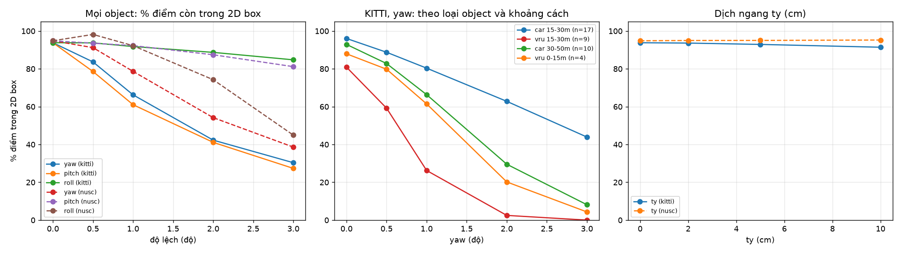
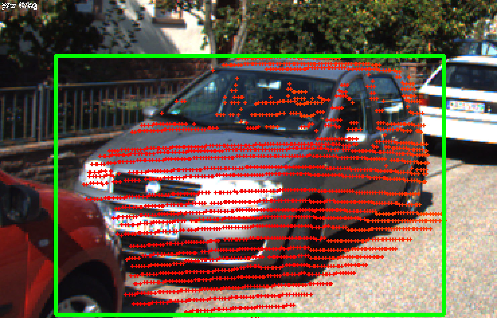
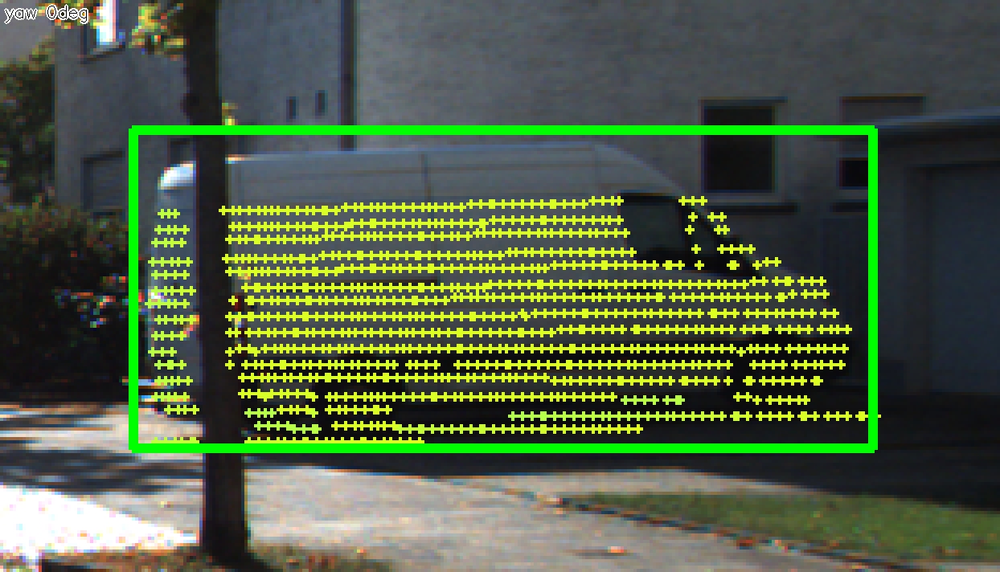
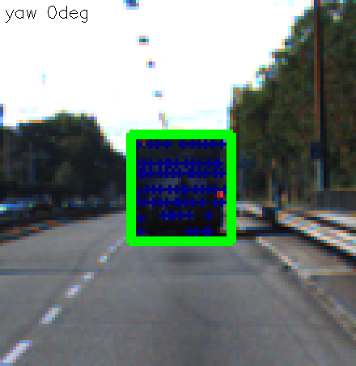
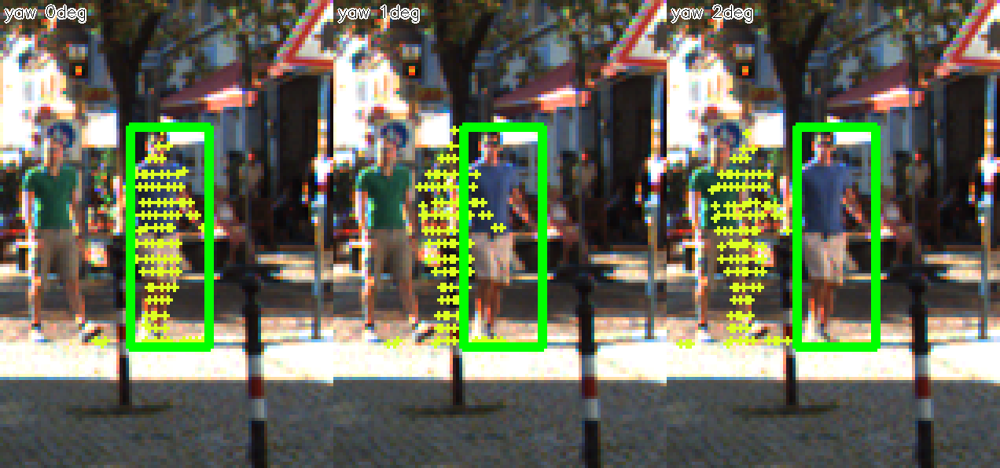
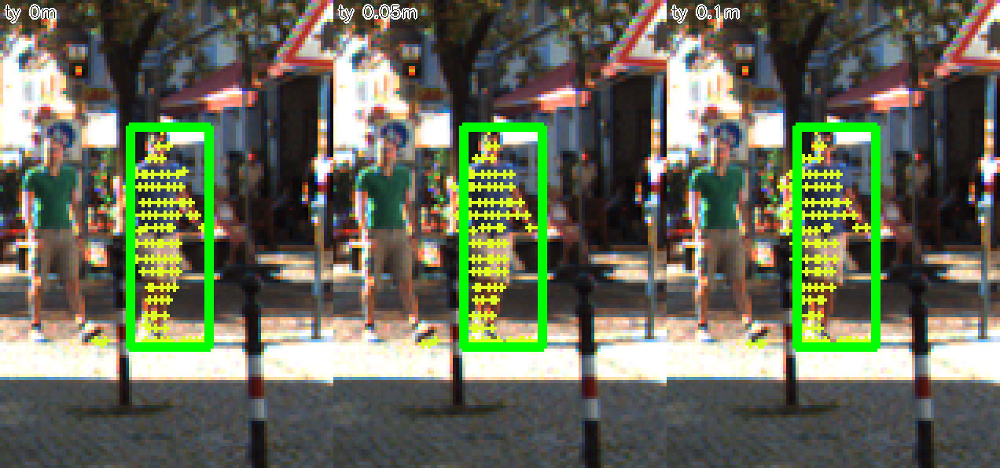

# Báo cáo Day 6: Độ nhạy của projection LiDAR-camera với calibration drift

- **Họ tên:** Ngô Gia Quốc
- **MSSV:** 2A202602757
- **Lớp:** [Track 4]
- **Link repo:** https://github.com/KuSenpai/NgoGiaQuoc-2A202602757-Track4-Day21
- **Topic:** A — Kiểm tra calibration LiDAR-camera bằng projection
- **Dataset:** data/synthetic (debug), data/kitti_mini (chính), data/nuscenes_mini_subset (so sánh)
- **Các frame đã dùng:** kitti_mini: cả 20 frame (70 object đủ điều kiện); nuscenes_mini_subset: cả 80 frame (354 object). Demo: synthetic 000000, kitti 000011, scene-0103_010

## 1. Claim

Trên KITTI, lệch yaw 1° làm **người đi bộ/cyclist ở 15–30 m** mất từ 81% xuống 26% số điểm LiDAR rơi trong 2D box của chính nó (n=9), trong khi **xe ở cùng khoảng cách** chỉ giảm từ 96% xuống 80% (n=17). Dịch ngang 10 cm gần như không đổi metric (93.8% → 91.4%), nên metric này không phát hiện được lỗi tịnh tiến.

## 2. Evidence

Metric: với mỗi object (truncated ≤ 0.3, occluded ≤ 1, ≥ 5 điểm), lấy các điểm LiDAR nằm trong 3D box GT ở calib gốc, làm lệch extrinsic, chiếu lại đúng các điểm đó và đo **% điểm rơi vào 2D box label** (mẫu số là mọi điểm của object, điểm ra ngoài ảnh tính là trượt). Trung bình theo object. Phép đo tất định, không có seed, chạy lại ra đúng cùng số. Kết quả đầy đủ (yaw/pitch/roll 0–3°, ty 0–10 cm, chia theo loại và khoảng cách): `results/calib_drift_sweep_kitti.csv`, `results/calib_drift_sweep_nusc.csv`; theo từng object: `results/calib_drift_per_object_*.csv`.

% điểm trong 2D box theo yaw (toàn bộ object):

| yaw              | 0°  | 0.5° | 1°  | 2°  | 3°  |
| ---------------- | ---- | ----- | ---- | ---- | ---- |
| KITTI (n=70)     | 93.8 | 83.7  | 66.2 | 42.3 | 30.4 |
| nuScenes (n=354) | 94.8 | 91.2  | 78.6 | 54.2 | 38.6 |

Theo loại object và khoảng cách, KITTI, yaw 1° (0° → 1° → 2°):

| Nhóm                    | n  | 0°  | 1°  | 2°  |
| ------------------------ | -- | ---- | ---- | ---- |
| Xe 15–30 m              | 17 | 96.0 | 80.4 | 62.8 |
| Xe 30–50 m              | 10 | 92.9 | 66.3 | 29.5 |
| Người/cyclist 0–15 m  | 4  | 87.9 | 61.4 | 20.2 |
| Người/cyclist 15–30 m | 9  | 80.9 | 26.2 | 2.5  |

Đường cơ sở chỉ đạt ≈94%, không phải 100%, vì 2D box chỉ ôm phần nhìn thấy còn một số điểm 3D box nằm sát mép hoặc sát chân. Vì vậy mọi mức được so với 0°, không so với 100%. Ở nuScenes, roll 0.5° cho 98.2% (cao hơn 94.8% ở 0°) là nhiễu nhỏ do box nuScenes rộng; chỉ xu hướng từ 1° trở lên mới đáng tin.

Các trục khác (KITTI, 3°): pitch còn 27.4%, roll còn 84.8%, % điểm còn trong ảnh gần như không đổi (≥ 99.3%), tức "inside FOV" gần như vô dụng để phát hiện drift.

Giải thích khác biệt hai dataset (bonus B5): (1) **Quy ước trục LiDAR khác nhau.** KITTI có x phía trước, nuScenes có y phía trước, nên "roll quanh x" của nuScenes thực chất là xoay quanh trục ngang của xe, tương đương "pitch" của KITTI. Vì vậy ở 3° roll nuScenes còn 44.9% còn pitch nuScenes còn 81.1%, ngược với KITTI. (2) **2D box của nuScenes** do đề bài tính từ 8 góc của box 3D nên rộng hơn box KITTI (vẽ chặt), cho nên chịu lệch tốt hơn. (3) nuScenes có nhiều vật ở 15–30 m và thưa hơn (32 beam), nên mỗi object có ít điểm hơn (≈42 điểm/object so với ≈372 của KITTI).

Ảnh demo ở 3 khoảng cách (calib gốc, điểm màu theo depth): `results/figures/demo_overlay_near.png` (xe 7.9 m), `demo_overlay_mid.png` (van 21.3 m), `demo_overlay_far.png` (truck 69.3 m). Biểu đồ: `results/figures/calib_drift_curves.png`. Overlay toàn ảnh 3 dataset: `results/figures/overlay_*.png`.






## 3. Failure case

**Failure 1 — yaw 1° "dán" điểm của người này lên người bên cạnh** (KITTI frame 000043, người đi bộ ở 20.3 m, 101 điểm). Ở 0° gần như mọi điểm nằm trong box (còn vài điểm sát chân). Ở 1° điểm trượt sang trái ≈ 0.35 m (20.3 m × tan 1°) và phủ lên người mặc áo xanh bên cạnh, còn người trong box thì gần như trống điểm; ở 2° điểm rơi hẳn ra ngoài box. Hậu quả: nếu dùng điểm để gán depth/nhãn cho box 2D, người trong box nhận depth của nền hoặc của người khác. Một người đi bộ rộng khoảng 0.5 m nên chỉ cần dịch 0.35 m là hỏng, trong khi xe rộng 1.8 m vẫn chịu được. Lớp lỗi: **Geometry** (extrinsic lệch): sai số góc nhân với khoảng cách thành sai số ngang tính bằng mét, nên vật càng xa và càng hẹp càng dễ hỏng.



**Failure 2 — dịch ngang 10 cm không bị metric phát hiện** (cùng người đó; tổng thể KITTI 93.8% → 91.4%, nuScenes không đổi/tăng nhẹ 94.8% → 95.2%). Ở 10 cm điểm chỉ lệch sang trái vài pixel và vẫn nằm trọn trong box. Với object ở 20 m, 10 cm tương đương khoảng 4 pixel, nhỏ hơn dung sai của 2D box, nên "tỉ lệ điểm trong box" bị mù với lỗi tịnh tiến. Lớp lỗi: **Metric** (metric không đủ nhạy cho mục đích phát hiện drift). Cách khắc phục: dùng alignment score nhạy với biên (khớp depth-edge với Canny) hoặc kiểm tra trên vật ở gần, nơi 10 cm ứng với nhiều pixel hơn. Phần này chưa làm (mức Advanced).



## 4. Khuyến nghị nếu triển khai thật

Use-case: ADAS với camera-LiDAR fusion, nơi điểm LiDAR được dùng để gán depth cho box 2D của người đi bộ. Sensor bracket lệch 1° sau va chạm nhẹ thì xe vẫn tin cậy (96% → 80% ở 15–30 m) nhưng người đi bộ thì hỏng (81% → 26%), và lỗi này **không thể thấy từ % điểm trong ảnh** (≈ 100% mọi mức). Khuyến nghị: (1) đặt ngưỡng cảnh báo drift trên metric "% điểm LiDAR của object nằm trong 2D box detector" tính trên người/cyclist ở 15–30 m, vì đây là nhóm nhạy nhất; (2) ghi log theo từng chuyến: median % điểm trong box theo khoảng cách và loại object, độ lệch thời gian LiDAR-camera, tốc độ xe; (3) trade-off: chạy kiểm tra trên mọi frame tốn tính toán, nên chạy 1 Hz hoặc khi có sự kiện va chạm/rung mạnh và so với đường cơ sở của chính xe; (4) metric hiện tại mù với lỗi tịnh tiến vài cm, nên cần thêm edge-alignment score. Hạn chế: mẫu nhỏ (KITTI chỉ 9 người/cyclist ở 15–30 m, 4 ở 0–15 m, 0 ở xa), nên kết luận về khoảng cách xa dựa chủ yếu vào xe và nuScenes.

## 5. Cách chạy lại

```bash
pip install -r requirements.txt
python -m starter.projection --data-root data/synthetic --frame 000000
python -m starter.projection --data-root data/kitti_mini --frame 000011
python -m starter.projection --data-root data/nuscenes_mini_subset --frame scene-0103_010
python -m src.drift_sweep --data-root data/kitti_mini --tag kitti
python -m src.drift_sweep --data-root data/nuscenes_mini_subset --tag nusc
python -m src.make_figures
python tools/check_submission.py
```

Các script `src/drift_sweep.py` và `src/make_figures.py` có `--help` (bonus B4).

## 6. Khai báo sử dụng AI

| Công cụ                | Dùng cho việc gì                                                                                                                  | Bạn đã kiểm chứng thế nào                                                                                                                                                                                                                           |
| ------------------------ | ------------------------------------------------------------------------------------------------------------------------------------ | ---------------------------------------------------------------------------------------------------------------------------------------------------------------------------------------------------------------------------------------------------------- |
| Claude Code (Sonnet 5.5) | Viết 2 hàm TODO trong`starter/projection.py`, viết `src/drift_sweep.py`, `src/make_figures.py`, và dựng bản nháp REPORT | Test điểm LiDAR (10, 0, 0) cho z_cam = 9.73 và pixel (614, 175) đúng như đề bài, điểm NaN và điểm sau camera bị loại; xem ảnh overlay thấy điểm khớp xe/người/cột; số liệu trong REPORT lấy trực tiếp từ CSV do code sinh ra |
